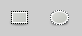
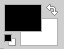

#### Draw a rectangle or a circle
1. In the toolbar select either the rectangle or circle select tool:  
    
1. Click and drag around the area where you’d like the rectangle/circle
1. Change the colour as desired by double-clicking the colour palette:  
    
1. Go to the *Edit* menu > *Stroke Selection* > adjust *Line width* as desired > *Stroke*

#### Blending two images
[http://boitblog.blogspot.com/2007/07/blending-two-images-with-gimp.html](http://boitblog.blogspot.com/2007/07/blending-two-images-with-gimp.html)

#### Adding transparency to an image
[http://graphicdesign.stackexchange.com/a/6460](http://graphicdesign.stackexchange.com/a/6460)

#### Making the background uniform
For example, if you scanned a picture of your signature on a white page, getting just the signature and getting rid of the background scan so it’s completely transparent
1. *Layer* > *Transparency* > *Threshold Alpha…* > *OK*

Or:

1. *Layer* > *Transparency* > *Alpha to Selection*
1. *Select* > *Invert*
1. *Edit* > *Clear* (or press the *Delete* key)
1. *Select* > *None*

#### Make transparency show up as grey checkerboard
*Edit* > *Preferences* > *Display* > *Transparency* > *Mid-tone Checks*

#### Creating a new layer from selection
1. Make the selection
1. *Edit* > *Copy*
1. *Edit* > *Paste as* > *New Layer*

#### Select a region using edge detection
1. Click on the *Scissors Select Tool*

1. Click where you want to start edge detection

1. Drag the first point as desired

1. Click to add the second point and drag as desired

1. Continue until you reconnect to the first point

1. Drag points to make further adjustments as desired

1. Click on the inside to turn it into a selection
    Note: this will prevent you from making further changes
